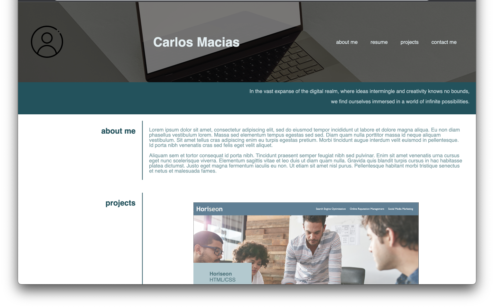
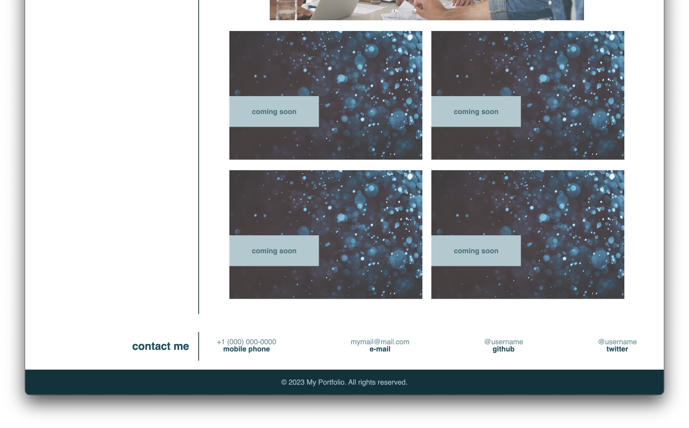

# my-portfolio-website

## Description
This repository hosts the Module 2 challenge, which is a part of my web development course. The repository contains all the code necessary to build and display my personal portfolio website.

## Instalation
N/A

## Usage
You can visit the live website by clicking on the following link:
 https://carlos-2mm.github.io/my-portfolio-website/

A preview of the website:

## Credits

https://developer.mozilla.org/en-US/play
 The content of this website helped in understanding how flexboxes work.

https://www.w3schools.com/howto/howto_css_hero_image.asp
  Te content of this website helped learning how hero images
work.

The resource for the hero image can be found at the following URL:
 https://www.pexels.com/photo/close-up-shot-of-a-laptop-computer-on-gray-surface-12883026/

The image with Adobe Stock ID #351608746 was used in the project.

## License

Please refer to the LICENSE in repo.